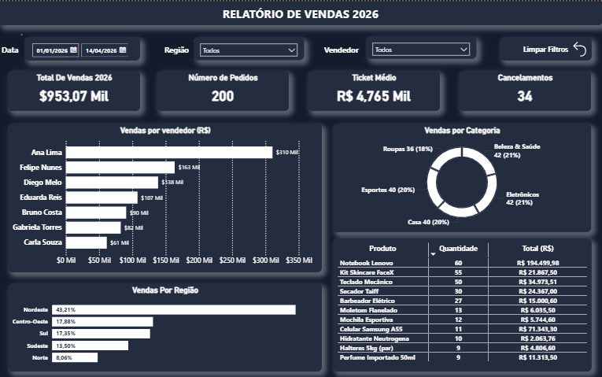

# 📊 Dashboard de Vendas 2026 — Power BI

Dashboard interativo de vendas desenvolvido no Power BI, conectado a uma planilha de dados que atualiza as métricas automaticamente conforme novos registros são inseridos.



---

## 🚀 Sobre o Projeto

Este projeto foi criado para centralizar e visualizar os principais indicadores de desempenho comercial de uma equipe de vendas. Com atualização dinâmica dos dados, o dashboard permite acompanhar resultados em tempo real sem necessidade de ajustes manuais.

---

## 📌 Métricas Exibidas

- **Total de Vendas 2026** — Receita total acumulada no período
- **Número de Pedidos** — Quantidade total de pedidos realizados
- **Ticket Médio** — Valor médio por pedido
- **Cancelamentos** — Total de pedidos cancelados no período

---

## 📈 Visualizações

| Gráfico | Descrição |
|---|---|
| Vendas por Vendedor | Ranking de desempenho individual em R$ |
| Vendas por Região | Distribuição percentual por região do país |
| Vendas por Categoria | Gráfico de rosca com proporção por categoria de produto |
| Top Produtos | Tabela com quantidade vendida e receita por produto |

---

## 🔧 Filtros Disponíveis

- **Data** — Intervalo de datas personalizável
- **Região** — Filtro por região (Nordeste, Centro-Oeste, Sul, Sudeste, Norte)
- **Vendedor** — Filtro por vendedor individual

---

## 🗂️ Estrutura do Repositório

```
📁 Dashboard-Vendas/
├── 📊 dashboard_vendas_2026.pbix   # Arquivo principal do Power BI
├── 📄 dados_vendas.xlsx           
├── 🖼️ dashboard_preview.png        # Print do dashboard
└── 📝 README.md
```

---

## ▶️ Como Usar

1. Faça o download ou clone este repositório
2. Abra o arquivo `dashboard_vendas_2026.pbix` no **Power BI Desktop**
3. Conecte à sua própria planilha de dados seguindo a mesma estrutura do arquivo `dados_vendas.xlsx`
4. Clique em **Atualizar** — o dashboard se adapta automaticamente aos novos dados

---

## 🛠️ Tecnologias Utilizadas

- [Power BI Desktop](https://powerbi.microsoft.com/)
- Microsoft Excel (.xlsx) como fonte de dados

---

## 📋 Pré-requisitos

- Power BI Desktop
- Microsoft Excel ou qualquer editor de planilhas compatível com `.xlsx`

---

## 📬 Contato

Desenvolvido por **Gabriel Orlandi Portes**

[](www.linkedin.com/in/gabriel-orlandi-portes)
[](https://github.com/Gabriel-Orlandi-Portes)
